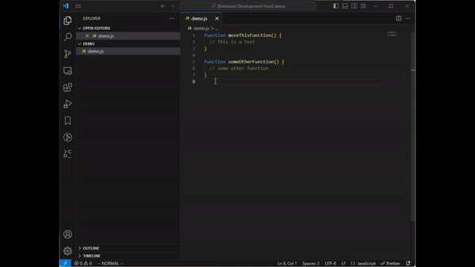

# vscode-js-move-function-to-file

VS Code extension for moving a js/jsx/ts/tsx function to its own file.

## Known Issues

Functions in object properties are not supported.

## Release Notes

### 1.0.1

Add extension icon

### 1.0.0

Initial release
